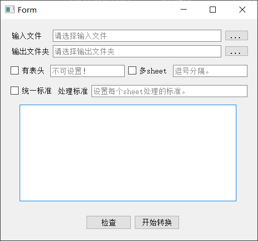

<!--
 * @Description: 
 * @Date: 2022-03-20 19:34:54
 * @Author: YiShengfeng < yishengfeng@qq.com >
 * @LastEditors: YiShengfeng
 * @LastEditTime: 2022-03-20 20:46:44
-->
# Excel拆分工具

## 使用说明

程序界面

* `输入文件`:需要处理的文件，支持xls、xlsx
* `输出文件夹`:拆分完输出的文件夹，输出为`*.xlsx`格式
* `有表头`:选择有无表头，若有则需要设置表头行数
* `多sheet`:有无多个sheet，若有则需要设置每个sheet中需要处理的列号，若不需要处理则空格跳过，列号之间用英文逗号分隔
* `统一标准`:需要处理的sheet是否使用相同的标准，若不同sheet标准不同则需要手动输入，相同数字的处理标准相同，不需要处理的空格跳过，处理标准号之间用英文逗号分隔，此处需要与sheet列号行数一致
* `检查`:转换之前先检查是否有错误，之后才能进行转换
* `开始转换`:按照设置将excel文件进行拆分输出